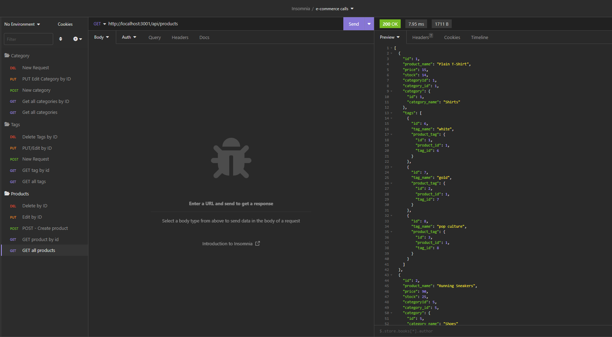

# e-commerce-app
Back end for an e-commerce site. App uses Express.js API and  Sequelize to interact with a MySQL database.

[Link to Walkthrough video](https://drive.google.com/file/d/1Ia7MX1CN6YaBz27If2rHajqI2T8ywxR4/view)